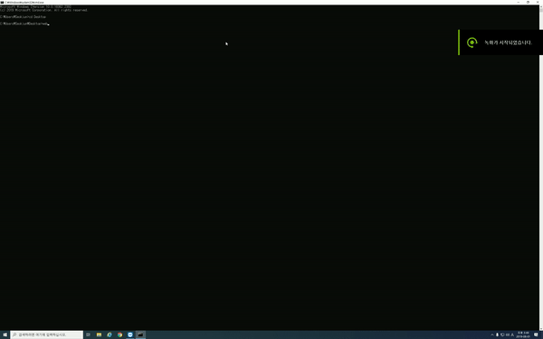

# 네이버 증권(주식) 웹 크롤링

위 예시는 200여개 사이트에서 동시에 데이터를 가져오는 작업입니다.
***
## ※ 과도한 실행으로 인한 트래픽 과부하를 절대 금하며 모든 책임은 당사자에게 있습니다.
***

## 1. 주요 기능

- 원하는 주식의 데이터를 실시간으로 가져오기

- 가져온 데이터를 csv파일로 저장하기

- 데이터를 축적해야 하거나 머신러닝으로 사용하기 위한 데이터가 필요한 경우 활용

- 조회 중 상장폐지된 것으로 판단되는 종목은 "□□□종목이 상장폐지 되었습니다."로 출력

- 멀티프로세서를 활용하여 크롤링 속도를 높였습니다.(각 cpu마다 적당한 스레드 갯수는 다릅니다.)

***

## 2. 설명

- 원하는 주식을 지속적으로 데이터를 가져오고 싶을 경우 list.txt에 해당 추식명과 코드를 기재 시

    list.txt 파일을 참조하여 주식 장시간 동안 일정 주기로 데이터를 가져옵니다.
 
 
- 코드 상 주식장시간은 오전 8시 반부터 오후 3시 반으로 지정했으며

    시간 내 최초 1회 실행 후 장 마감 시 자동으로 프로그램은 종료됩니다.
 
 
- 가져온 데이터는 copy.csv, copy2.csv, copy3.csv 형태로 저장되며

    데이터 확인은 웬만하면 장 마감 후를 권장합니다.
 
 
- 필요할 경우 original.csv가 아닌 copy1.csv 혹은 copy2.csv를 활용하고

    동시에 실행 시엔 에러가 발생할 수 있습니다.

